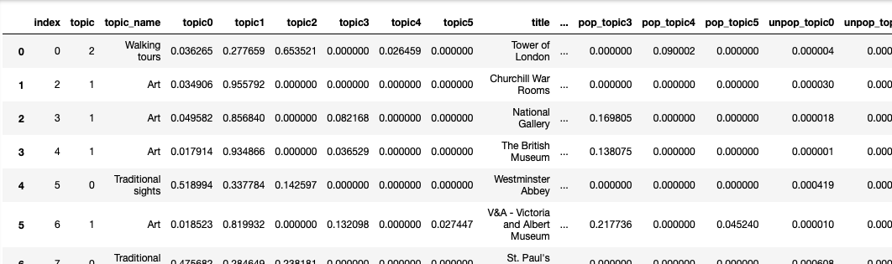
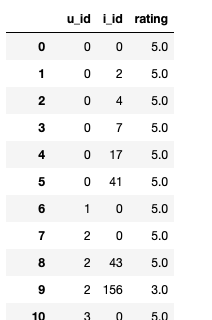

# Data and code for the undergraduate thesis + the text and presentation
### Recommendation system for travelers based on TripAdvisor.com data

*thesis.docx* and *presentation.pptx* - thesis text and presentation respectively.

*attractions.csv* - a 975 x 29 table with the data on 975 London attractions listed on TripAdvisor. Columns include: index (item id), title, category, rating, number of reviews, link, image link and 6 topic scores and popularity scores as described in the thesis.

*ratings_reshaped.csv* - a 75490 x 3 table  with numeric ratings represented by three columns: user id, item id and rating.

*reviews.txt* - a txt file with 975 lines of concatendated reviews corresponding to each attraction in the attractions.csv file in the same order.

*lda_svd.py* - python code used to train the LDA and FunkSVD models.
